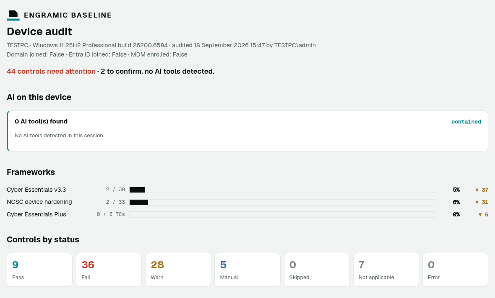
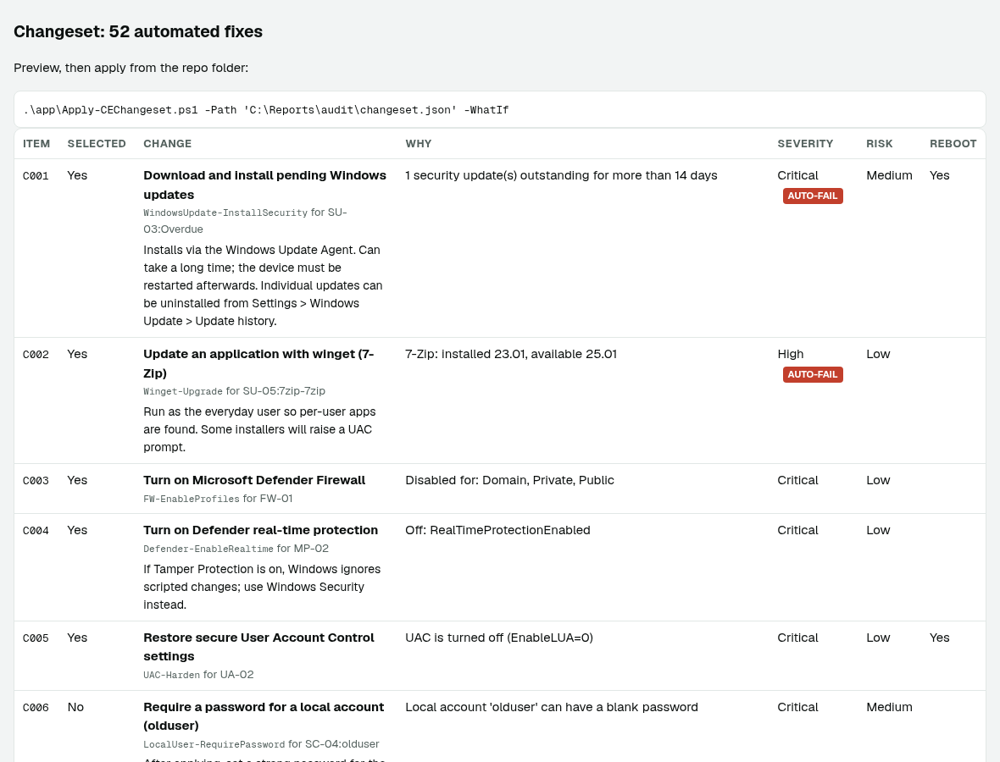

# Engramic Baseline

[](https://github.com/engramic-ai/baseline-tool/actions/workflows/ci.yml)
[](https://www.ncsc.gov.uk/sites/default/files/documents/cyber-essentials-requirements-for-it-infrastructure-v3-3.pdf)
[](https://www.ncsc.gov.uk/files/cyber-essentials-plus-test-specification-v3-2.pdf)
[](https://www.ncsc.gov.uk/collection/device-security-guidance/platform-guides/windows)
[](#development)
[](docs/INTUNE.md)

**Secure the Windows devices your AI agents run on.**

Shadow AI turns up on your devices first.

Engramic Baseline checks permissions, vulnerabilities, configuration and malware protection; then gives you fixes to review, preview, apply and roll back.

It also maps results to Cyber Essentials v3.3, NCSC Windows hardening guidance and Cyber Essentials Plus device-test readiness.

Free and open source.

[**Download on GitHub &rarr;**](https://github.com/engramic-ai/baseline-tool/releases)

Supports Windows 11 and Windows Server 2016 to 2025.



<sub>Report from a simulated test laptop. The checks and fixes are the real ones.</sub>

**Read first. Change nothing.** Baseline's audit is read-only: it shows you what it found and proposes fixes, and nothing changes until you explicitly apply a changeset.

## What it checks

AI agents inherit the security posture of the devices they run on. Baseline checks the things that determine how much an agent could do if its access, process or credentials were compromised.

| | |
|---|---|
| **Permissions** | Who has administrator rights, how people sign in, account controls and MFA requirements for cloud services. |
| **Vulnerabilities** | Missing Windows, application and firmware updates, unsupported software and Windows versions, and BIOS updates. |
| **Configuration** | Secure defaults and accounts, firewall configuration, remote access, legacy Windows features and virtualisation boundaries. |
| **Malware protection** | Antivirus presence, health and update status, Defender protections and third-party antivirus. |
| **Boot integrity** | Secure Boot, TPM 2.0, BitLocker and readiness for Microsoft's 2023 Secure Boot certificates. |

## Why AI agents change the baseline

An AI coding assistant doesn't get a special security boundary just because it's an AI tool. It inherits the permissions, network access, credentials and weaknesses of the environment it runs in.

That's why Baseline treats AI tools alongside the Windows security controls they inherit.

The per-user probe detects recognised AI assistants and agents, identifies their execution context, and reports relevant WSL, VM and container environments that may extend their reach. Deeper agent coverage is planned as a separate add-on.



<sub>Every finding comes with a fix you can preview, apply and roll back.</sub>

> This is a self-assessment aid, not certification. It doesn't replace an IASME-licensed Certification Body, and it can only see the device it runs on. Your routers, cloud tenants and other devices are also in scope for certification.
>
> Cyber Essentials is an NCSC scheme delivered by IASME. This project isn't affiliated with or endorsed by NCSC or IASME.

### In 30 seconds

**One device:** download the repo, then double-click **`app\Start-EB.cmd`** and press **Run audit**. No desktop (Windows Server Core, or SSH/RDP-only)? Use the [command line](#command-line) instead.

**A fleet:** in an elevated prompt, run `.\intune\Test-IntuneDeployment.ps1` to rehearse the deployment, then `.\intune\Build-IntunePackage.ps1 -DownloadTool` to build the package, and follow [docs/INTUNE.md](docs/INTUNE.md). Or download a ready-made package from [Releases](https://github.com/engramic-ai/baseline-tool/releases).

---

## Quick start

1. Download or clone the repo: `git clone https://github.com/engramic-ai/baseline-tool`
2. If you downloaded a zip, unblock the files first: `Get-ChildItem -Recurse | Unblock-File`
3. Double-click **`app\Start-EB.cmd`** and press **Run audit**.

For full coverage, use **Restart as administrator** in the app and run the audit again. Some settings (BitLocker, audit policy, Defender exclusions, optional features) can only be read by an administrator.

### Test the Intune deployment on your own machine

From an elevated prompt:

```powershell
.\intune\Test-IntuneDeployment.ps1
```

This installs the tool, runs the audit as SYSTEM, runs the compliance script the way Intune does (in both 32-bit and 64-bit hosts), checks the output against the compliance rules, then uninstalls. The details are under [Deploying across your organisation](#deploying-across-your-organisation-intune).

### Command line

```powershell
# Read-only audit. Writes a report and changeset to .\output\<PC>-<timestamp>\
powershell -ExecutionPolicy Bypass -File .\app\Invoke-CEAudit.ps1

# Cyber Essentials checks only, and list what's available
.\app\Invoke-CEAudit.ps1 -CEOnly
.\app\Invoke-CEAudit.ps1 -ListChecks

# Preview, then apply the pre-selected fixes (elevated prompt for machine settings)
.\app\Apply-CEChangeset.ps1 -Path .\output\PC01-20260916-101500\changeset.json -WhatIf
.\app\Apply-CEChangeset.ps1 -Path .\output\PC01-20260916-101500\changeset.json

# Apply specific items only, including high-risk ones you've reviewed
.\app\Apply-CEChangeset.ps1 -Path ...\changeset.json -ItemId C003,C007 -IncludeHighRisk

# Roll back
.\app\Restore-CEChangeset.ps1 -Path .\output\PC01-20260916-101500\undo-20260916-102233.json
```

**Run it twice.** An un-elevated run as the everyday user is what tests account separation (CE+ TC5), per-user app updates (winget) and per-user Office macro settings. An elevated run covers the machine settings.

---

## The app

| Tab | What it's for |
|---|---|
| **Overview** | The audit message, the AI and shadow-AI summary, a judgement bar per framework (Cyber Essentials v3.3, NCSC hardening, CE+) and a control-status breakdown |
| **AI** | The recognised AI tools and agents detected, whether each is contained or deviating, and the WSL, VM and container environments in scope - the shadow-AI picture in one place |
| **Frameworks** | Each framework judged on its own: CE+ TC1 to TC5 readiness and results by control theme |
| **Controls** | Every control result, filterable by theme, status or text, with what was expected, what was found, what to do and the evidence behind it |
| **Fixes** | The changeset. Tick fixes, **Preview** (nothing changes), then **Apply**. Auto-fail fixes are listed first. High-risk fixes are never pre-ticked. |
| **Manual actions** | Things a script can't do safely or can't see, such as MFA attestation, software review and Tamper Protection |
| **History** | Every applied changeset with one-click **Roll back** |

**Choose checks...** next to **Run audit** opens a list of every check grouped by control theme, with presets for all checks or Cyber Essentials only. Your choice is remembered. Running only some checks gives a result marked *PARTIAL*.

Audits and fixes run in the background, so the window stays responsive. After fixes are applied, the related checks run again to confirm they took effect.

---

## Deploying across your organisation (Intune)

The full step-by-step guide is in **[docs/INTUNE.md](docs/INTUNE.md)**. In short:

```powershell
.\intune\Test-IntuneDeployment.ps1           # 1. rehearse on one machine (elevated)
.\intune\Build-IntunePackage.ps1 -DownloadTool   # 2. build the .intunewin and upload files
#                                                3. follow build\INTUNE-SETTINGS.md in the Intune portal
```

Alternatively, push a tag such as `v0.2.0` and download the ready-made package from the GitHub release.

| Intune feature | What you get |
|---|---|
| **Win32 app** | Installs to Program Files (locked down) and registers a **daily scheduled task running as SYSTEM** that audits the device and writes `%ProgramData%\EngramicBaseline\status.json`, a full report and an event log entry, plus a **per-user task** that runs the shadow-AI/WSL checks as each signed-in user |
| **Custom compliance** | `Discover-CECompliance.ps1` plus a rules file, so each device reports compliant or not compliant, with user-facing reasons in Company Portal. There's a lenient rules file (automatic fails, supported OS, antivirus, audit freshness) and a strict one (full Cyber Essentials). |
| **Remediations** (optional) | A tenant-wide report with one line per device showing the compliance state, counts and failing check IDs. It can also apply fixes you allow-list. |

Compliance is based on the last scheduled audit. A device that hasn't completed an audit in 72 hours is **not compliant**, so a broken install can't pass silently.

## The checks in detail

57 checks across the five Cyber Essentials control themes, plus NCSC hardening and the AI/virtualisation footprint. The full list, with the requirement each check maps to, is in [docs/CONTROL-MAPPING.md](docs/CONTROL-MAPPING.md).

| Theme | Examples |
|---|---|
| **Firewalls** | Firewall on for every profile; inbound blocked by default; custom inbound rules reviewed; RDP off or protected with NLA; no bridged networking or ports published to the network by virtual machines and containers |
| **Secure configuration** | Guest and built-in Administrator disabled; stale accounts; blank passwords; AutoRun off; screen lock at 15 minutes or less; **lockout after 10 or fewer attempts**; **Windows Hello PIN of 6 or more characters**; legacy features (SMBv1, PowerShell 2.0) removed; **virtual machines, WSL distributions and containers listed as in scope**, with warnings for shared folders and WSL mounting the Windows drives |
| **Security update management** | **Supported Windows build**: Windows 11 and Windows Server 2016 to 2025, with end-of-support warnings; automatic updates on and not paused; **no security updates outstanding for more than 14 days** *(auto-fail)*; **apps up to date via winget** *(auto-fail)*; end-of-life software; browsers, Store and Office allowed to update; **BIOS/UEFI age and known-vulnerable TPM firmware** (ROCA, TPM-FAIL) |
| **User access control** | **Everyday account is a standard user** (CE+ TC5); UAC enforced; admin group membership; password length of 12 or more; no forced expiry or complexity rules; **MFA on every cloud service** *(auto-fail, by attestation)*; Windows Hello for Business and LAPS on managed devices; **recognised AI agents** (Claude, ChatGPT/Codex, Copilot, Cursor and others) detected and listed for MFA attestation, and flagged if running with administrator rights |
| **Malware protection** | Antivirus on and updated within 24 hours, including **third-party antivirus on Windows Server** (recognised from services, drivers and anti-virus file system filters); real-time, cloud and PUA protection; network protection; SmartScreen and Safe Browsing that users can't click past (CE+ TC3 download test); ASR rules; Office internet macros blocked; no broad Defender exclusions |
| **NCSC hardening** | BitLocker (TPM + PIN); Secure Boot and TPM 2.0; Secure Boot 2023 certificates (the 2011 Microsoft CAs expire in 2026); Memory Integrity and Credential Guard; LSA protection; WDigest, LM and NTLMv1 off; LLMNR and NetBIOS off; SMB signing; audit policy, command-line and PowerShell logging; backup attestation |

### Cyber Essentials Plus

The report estimates how the device would fare in the CE+ tests:

| Test | Covered by |
|---|---|
| TC1 Remote vulnerability scan | Run externally by your assessor. Locally, firewall and RDP exposure, and ports that virtual machines and containers publish to the network (FW-07), are checked. |
| TC2 Patching | SU-01, SU-03, SU-04, SU-05, SU-06 |
| TC3 Malware | MP-01 to MP-03, MP-05 to MP-08, MP-10, and MP-11: a download test with EICAR's harmless test files, linked from the HTML report. The estimate stays at *Check* until that test has passed |
| TC4 MFA | UA-07 (attestation) |
| TC5 Account separation | UA-01, UA-02 |

### MFA attestation

A script can't log in to your cloud services to check MFA, so v3.3's MFA auto-fail is handled by attestation. Edit `config/cloud-services.json`:

```json
{ "name": "Microsoft 365 / Entra ID", "mfaEnforced": true, "adminMfaEnforced": true, "verifiedOn": "2026-09-16", "verifiedBy": "IT admin" }
```

Installed apps such as OneDrive, Dropbox, Slack and Xero are detected and listed as needing an attestation. Attestations older than 12 months are flagged.

---

## Safety design

- **The audit only reads settings.** Nothing changes until you apply a changeset.
- **Changesets can't run arbitrary code.** Each item names a remediation from a fixed library (`src/CEAudit/Remediations`) plus simple parameters, and every parameter is checked again at apply time against allow-lists and patterns.
- **Everything is reversible where possible.** Registry changes record their previous value, and other changes record a generated undo command. Windows and app updates are marked as not reversible.
- **Risky changes need an explicit choice.** High-risk items (disabling accounts, Memory Integrity by registry, Credential Guard) are never pre-selected, and the CLI also needs `-IncludeHighRisk`.
- **There are guard rails.** It won't disable the built-in Administrator if it's the only admin, won't disable the signed-in account, and won't turn off password complexity until a 12-character minimum is in place.
- **It warns about central management.** On domain, Entra or Intune devices, it warns that local changes may be overwritten, so fix the policy at its source.
- **Packs must be locked down.** Feature packs installed under `%ProgramData%` are only loaded if nobody but administrators can change them, because audits run elevated or as SYSTEM. See [docs/PACKS.md](docs/PACKS.md).
- **Results stay local.** `output/` is git-ignored because reports contain device details. On managed devices, reports and status are readable by administrators only.
- **One small lookup leaves the device.** To check for BIOS updates, SU-08 asks the hosted firmware catalog (`https://baseline.engramic.ai`) about the vendor and 4-character model id, e.g. `dell/0CF1`. No serial number, device name, user or audit results are sent, answers are cached for 12 hours, and the check falls back to BIOS age when offline. Set `baseUrl` to `""` in `config/firmware-catalog.json` to turn it off.

---

## Configuration

| File | Purpose |
|---|---|
| `config/thresholds.json` | Patch window (14 days), lockout (10), password length (12), PIN length (6), screen lock (900 s), signature age, firmware age warning (730 days) and more |
| `config/secure-boot.json` | Secure Boot certificates NC-08 expects, the expiry dates of the 2011 CAs they replace, and the servicing event IDs it reads |
| `config/firmware-catalog.json` | Address of the hosted firmware catalog service. SU-08 compares the installed BIOS with the latest release for the model. On by default (`https://baseline.engramic.ai`); set `baseUrl` to `""` to turn it off |
| `config/av-products.json` | Security products MP-01 recognises from their service and driver names (25 products), and whether each blocks malware or only detects it. Add products your organisation uses |
| `config/tpm-firmware-advisories.json` | TPM firmware versions affected by known vulnerabilities, used by SU-08. Review it when new TPM advisories are published |
| `config/os-lifecycle.json` | Windows 11 end-of-servicing dates by release and edition. **Review this periodically**: SU-01 warns when it's more than 90 days old |
| `config/unsupported-software.json` | End-of-life products to flag. Add your own. |
| `config/asr-rules.json` | ASR rules to recommend. `standard: true` rules are proposed in Block mode, the rest in Audit mode. |
| `config/ai-tools.json` | AI assistants and agents recognised on the device (20 tools): how to detect them, which account they use, and whether they can run commands or change files |
| `config/virtualisation.json` | Processes that publish ports for virtual machines and containers (FW-07), and WSL distributions created by container tools that SC-12 doesn't warn about |
| `config/malware-test.json` | Test file links for the malware download test (MP-11), and where to record the result when you don't use Microsoft Defender |
| `config/cloud-services.json` | MFA attestations and detection hints |
| `config/scheduled-audit.json` | Checks to skip in the unattended (scheduled / Intune) audit |
| `config/auto-remediation.json` | Fixes the Intune Remediations script may apply automatically (off by default) |

On managed devices, a file with the same name in `%ProgramData%\EngramicBaseline\config\` replaces the packaged one, so you can change settings on individual devices without rebuilding.

---

## Development

```powershell
Install-Module Pester -MinimumVersion 5.5 -Scope CurrentUser
Install-Module PSScriptAnalyzer -Scope CurrentUser

Invoke-Pester -Path .\tests -Output Detailed
Invoke-ScriptAnalyzer -Path . -Recurse -Settings .\.github\PSScriptAnalyzerSettings.psd1
.\tools\Export-ControlMapping.ps1      # regenerate docs/CONTROL-MAPPING.md
```

The tests mock Windows, simulating an insecure and a hardened device, so they also run on Linux. They also cover the status file, the compliance discovery script evaluated against both rules files, the Remediations detection script, and a real headless run of the scheduled audit.

The suite refuses to run elevated (so an escaped write is denied, not applied), mocks every device-changing command inside the module to throw unless a test mocks it deliberately, and checks statically that no check file can change the device and that the front ends only call exported functions.

### Trying fixes for real: Windows Sandbox

Because every write is mocked, the suite cannot tell you that a fix really takes on a live Windows and really comes back off. For that, run the cycle in a disposable Windows Sandbox (Pro, Enterprise or Education; enable *Windows Sandbox* under Settings > Optional features > More Windows features):

```powershell
.\tools\sandbox\New-SandboxRun.ps1                        # audit, apply selected fixes, audit, roll back, audit, compare
.\tools\sandbox\New-SandboxRun.ps1 -PesterPath C:\modules  # also run the whole suite elevated inside the sandbox
```

The repository is mapped read-only and networking is off, so nothing leaves the sandbox and nothing on the host changes. Results (three audits, the undo log, `summary.md` with a before/after/restored table per finding, and a transcript) land in `build\sandbox\results\apply-rollback\<timestamp>\`. Closing the sandbox window destroys it.

### Proving AI-tool detection against real installs

`config/ai-tools.json` says where each AI tool leaves its traces. The lab installs the real thing and checks the rules against it, one tool at a time, in a sandbox with network access:

```powershell
.\tools\sandbox\New-SandboxRun.ps1 -Environment ai-lab -PesterPath C:\modules                       # the default seven
.\tools\sandbox\New-SandboxRun.ps1 -Environment ai-lab -PesterPath C:\modules -Tools cursor,ollama   # a subset
```

For each tool it asserts: a clean image detects nothing; the tool is detected after install and which rule fired; nothing else lit up; the running process is seen and UA-10 reports it (the sandbox user is an administrator); a seeded MCP config at the tool's documented path is found, parsed and its plaintext credential classified. `lab-summary.md` is a table with one row per tool. The install catalogue lives in `sandbox\tools.json`; the sandbox tooling itself (`sandbox\`) has no dependency on Baseline and is described in `sandbox\README.md`. The lab is deliberately not part of CI: a run downloads a few gigabytes and needs Windows Sandbox.

CI (`.github/workflows/ci.yml`) does two things:

- **Tests:** runs lint and the tests on Windows PowerShell 5.1 and PowerShell 7, and loads the desktop app's layout.
- **Deployment rehearsal:** runs the full Intune rehearsal on a Windows machine (install, audit as SYSTEM, discovery, rules, uninstall), then builds the package.

`release.yml` publishes the Intune package when you push a `v*` tag.

### Adding a check

```powershell
Register-CECheck -Id 'SC-12' -Category 'SecureConfiguration' -Severity 'Medium' `
    -Title 'Short, specific title' -Frameworks @('CE v3.3') `
    -Reference 'CE v3.3 Secure configuration: "quote the requirement"' `
    -Test {
        param($ctx)
        if ($ok) { return New-CEResult -Status 'Pass' -Expected '...' -Actual '...' }
        New-CEResult -Status 'Fail' -Expected '...' -Actual '...' -Recommendation '...' `
            -Remediation (New-CERemediationRef -Id 'Some-Remediation' -Parameters @{ Name = 'x' })
    }
```

Keep source files ASCII-only, because Windows PowerShell 5.1 misreads UTF-8 files without a BOM. A test enforces this.

### Feature packs

Packs add checks, remediations, categories and config without changing the core module. See [docs/PACKS.md](docs/PACKS.md).

### Layout

```
app/                        Entry points
  Start-EB.cmd              Double-click launcher for the app
  Start-CEAuditGui.ps1      WPF app
  Invoke-CEAudit.ps1        CLI audit
  Invoke-CEScheduledAudit.ps1 Unattended device audit as SYSTEM (scheduled task / Intune)
  Invoke-CEUserProbe.ps1    Per-user shadow-AI / WSL probe (runs as the signed-in user)
  Apply-CEChangeset.ps1     CLI apply (WhatIf, per-item, undo log)
  Restore-CEChangeset.ps1   CLI rollback
config/                     Thresholds and reference data
src/CEAudit/
  Private/                  Helpers, device context, check engine, remediation engine
  Checks/                   One file per control theme
  Remediations/             The fix library
  Public/                   Changeset, reports, apply
intune/
  Install-CEChecker.ps1       Win32 app install (Program Files, scheduled task, shortcut, detection key)
  Uninstall-CEChecker.ps1     Win32 app uninstall
  Detect-CEChecker.ps1        Win32 app detection script
  Discover-CECompliance.ps1   Custom compliance discovery script
  compliance-rules*.json      Custom compliance rules (strict and automatic-fail only)
  Detect-CECompliance.ps1     Remediations detection (per-device summary)
  Remediate-CECompliance.ps1  Remediations remediation (refresh audit, optional auto-fix)
  Build-IntunePackage.ps1     Builds .intunewin, upload files and portal settings
  Test-IntuneDeployment.ps1   Local end-to-end rehearsal as SYSTEM
tests/                      Pester tests
tools/                      Doc generation
docs/INTUNE.md              Intune deployment guide
docs/CONTROL-MAPPING.md     Generated requirement mapping
```

## References

- [NCSC: Cyber Essentials Requirements for IT Infrastructure v3.3](https://www.ncsc.gov.uk/sites/default/files/documents/cyber-essentials-requirements-for-it-infrastructure-v3-3.pdf)
- [IASME: Changes to Cyber Essentials for April 2026](https://iasme.co.uk/articles/important-update-changes-to-cyber-essentials-for-april-2026/)
- [NCSC: Cyber Essentials Plus test specification](https://www.ncsc.gov.uk/files/cyber-essentials-plus-test-specification-v3-2.pdf)
- [NCSC: Device security guidance, Windows](https://www.ncsc.gov.uk/collection/device-security-guidance/platform-guides/windows)
- [Microsoft: Intune custom compliance settings](https://learn.microsoft.com/en-us/intune/device-security/compliance/custom-settings)
- [Microsoft: Windows 11 release information](https://learn.microsoft.com/en-us/windows/release-health/windows11-release-information)

## Licence

Engramic Baseline is licensed under the **Apache License, Version 2.0** - see [LICENSE](LICENSE) and [NOTICE](NOTICE). "Engramic" and "Engramic Baseline" are trademarks of Engramic Ltd; the licence grants no rights to use them.

The app bundles the **Geist** and **Geist Mono** fonts (`app/fonts/`), which are licensed separately under the SIL Open Font License 1.1 ([app/fonts/OFL.txt](app/fonts/OFL.txt)).

We are not accepting external code contributions at this time - see [CONTRIBUTING.md](CONTRIBUTING.md). Bug reports and check/fix requests are welcome as issues.
